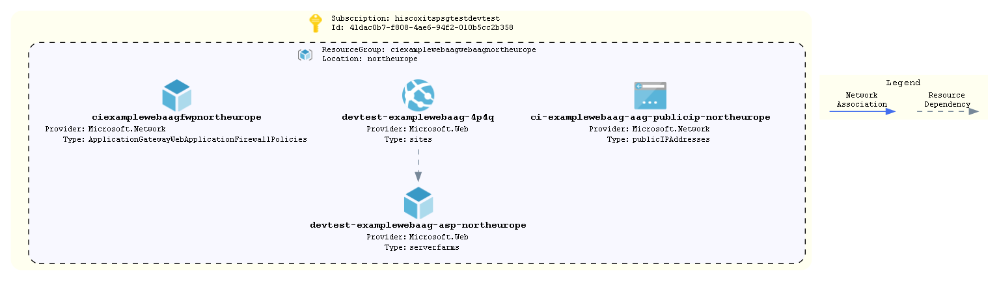

# WebApp integrated Application Gateway

This code is a demonstration of a webapp hosted on App Gateway.

The code creates the required app service (with a dummy hello world docker image running) and then fronts
it with a Application Gateway (AAG) and Web Application Firewall (WAF) policy that provide protection against
most common web vulnerabilities and attacks. The AAG uses the private IP in the backend pool and the host name
is overridden in the http settings. The App services access restrictions are configured to allow traffic from
the AGG IP address only.

In addition it adds records into Infoblox DNS to allow the webapp internal IP to be recognised.
This is to allow the Application Gateway to rewrite the headers from the friendly Hiscox name to the webapp URL

## How To Update this README.md

* terraform-docs has been used to automatically generate this readme based on comments, variables.tf and output.tf.
* Follow the setup instructions here: https://github.com/segmentio/terraform-docs
* Write your terraform-docs to a file like so: `terraform-docs md . | Out-File README.md`

## Diagrams



```pwsh
Connect-AzAccount
Set-AzContext -SubscriptionName 'hiscox its psgtest devtest'
Export-AzViz -ResourceGroup ci-examplewebaag-webaag-northeurope -Theme light -OutputFormat png -OutputFilePath 'diagrams/design.png' -CategoryDepth 1 -LabelVerbosity 2 -ExcludeTypes Microsoft.Network/applicationGateways
```

## Requirements

| Name | Version |
|------|---------|
| <a name="requirement_terraform"></a> [terraform](#requirement\_terraform) | >= 1.0 |
| <a name="requirement_azurerm"></a> [azurerm](#requirement\_azurerm) | ~> 2 |
| <a name="requirement_infoblox"></a> [infoblox](#requirement\_infoblox) | 2.0.1 |
| <a name="requirement_time"></a> [time](#requirement\_time) | ~>0.7 |

## Providers

| Name | Version |
|------|---------|
| <a name="provider_azurerm"></a> [azurerm](#provider\_azurerm) | ~> 2 |
| <a name="provider_infoblox"></a> [infoblox](#provider\_infoblox) | 2.0.1 |
| <a name="provider_time"></a> [time](#provider\_time) | ~>0.7 |

## Modules

| Name | Source | Version |
|------|--------|---------|
| <a name="module_as"></a> [as](#module\_as) | ../../azure-app-service-web | n/a |
| <a name="module_asp"></a> [asp](#module\_asp) | ../../azure-app-service-plan | n/a |
| <a name="module_gateway"></a> [gateway](#module\_gateway) | ../../azure-application-gateway | n/a |
| <a name="module_nsg"></a> [nsg](#module\_nsg) | ../../azure-network-security-group | n/a |
| <a name="module_subnet"></a> [subnet](#module\_subnet) | ../../azure-subnet | n/a |

## Resources

| Name | Type |
|------|------|
| [azurerm_resource_group.resource_group](https://registry.terraform.io/providers/hashicorp/azurerm/latest/docs/resources/resource_group) | resource |
| [infoblox_a_record.webapp_url](https://registry.terraform.io/providers/infobloxopen/infoblox/2.0.1/docs/resources/a_record) | resource |
| [time_static.t](https://registry.terraform.io/providers/hashicorp/time/latest/docs/resources/static) | resource |
| [azurerm_key_vault.kv](https://registry.terraform.io/providers/hashicorp/azurerm/latest/docs/data-sources/key_vault) | data source |
| [azurerm_key_vault_secret.infoblox_password](https://registry.terraform.io/providers/hashicorp/azurerm/latest/docs/data-sources/key_vault_secret) | data source |

## Inputs

| Name | Description | Type | Default | Required |
|------|-------------|------|---------|:--------:|
| <a name="input_address_prefixes"></a> [address\_prefixes](#input\_address\_prefixes) | The address range of the subnet to create | `list(string)` | n/a | yes |
| <a name="input_app_settings"></a> [app\_settings](#input\_app\_settings) | WebApp Site app settings | `map` | `{}` | no |
| <a name="input_application"></a> [application](#input\_application) | Name of the application | `string` | n/a | yes |
| <a name="input_environment"></a> [environment](#input\_environment) | The environment name. Used as a tag and in naming the resource group | `string` | n/a | yes |
| <a name="input_fqdn_url"></a> [fqdn\_url](#input\_fqdn\_url) | n/a | `string` | n/a | yes |
| <a name="input_infoblox_server"></a> [infoblox\_server](#input\_infoblox\_server) | n/a | `string` | `"10.64.17.10"` | no |
| <a name="input_infoblox_user"></a> [infoblox\_user](#input\_infoblox\_user) | n/a | `string` | `"svcinfobloxazureint"` | no |
| <a name="input_infoblox_view"></a> [infoblox\_view](#input\_infoblox\_view) | Infoblox view | `string` | `"Internal"` | no |
| <a name="input_key_vault_name"></a> [key\_vault\_name](#input\_key\_vault\_name) | Name of the key vault, used to retrieve VM admin password | `string` | n/a | yes |
| <a name="input_key_vault_rg"></a> [key\_vault\_rg](#input\_key\_vault\_rg) | Resource group that contains key vault | `string` | n/a | yes |
| <a name="input_location"></a> [location](#input\_location) | The region resources will be deployed to | `string` | `"northeurope"` | no |
| <a name="input_nsg_in_rules"></a> [nsg\_in\_rules](#input\_nsg\_in\_rules) | Map on Inbound NSG rules | `any` | n/a | yes |
| <a name="input_nsg_out_rules"></a> [nsg\_out\_rules](#input\_nsg\_out\_rules) | Map on Outbound NSG rules | `any` | n/a | yes |
| <a name="input_site_config"></a> [site\_config](#input\_site\_config) | Site config to override site\_config\_defaults. Object structure identical to site\_config\_defaults | `map` | `{}` | no |
| <a name="input_sku"></a> [sku](#input\_sku) | The Sku of the ASP | `map(string)` | `{}` | no |
| <a name="input_subnet_name"></a> [subnet\_name](#input\_subnet\_name) | The name of the subnet to create | `string` | n/a | yes |
| <a name="input_tags"></a> [tags](#input\_tags) | List of tags to be applied to resources | `map(string)` | `{}` | no |
| <a name="input_vnet_name"></a> [vnet\_name](#input\_vnet\_name) | The name of the target virtual netowrk | `string` | n/a | yes |
| <a name="input_vnet_resource_group_name"></a> [vnet\_resource\_group\_name](#input\_vnet\_resource\_group\_name) | The resource group that contains to target virtual network | `string` | n/a | yes |

## Outputs

| Name | Description |
|------|-------------|
| <a name="output_resource_group_name"></a> [resource\_group\_name](#output\_resource\_group\_name) | Name of the resource group where resources have been deployed to |
| <a name="output_webapp_hostname"></a> [webapp\_hostname](#output\_webapp\_hostname) | WebApp hostname |
| <a name="output_webapp_private_ip"></a> [webapp\_private\_ip](#output\_webapp\_private\_ip) | WebApp private\_ip |
