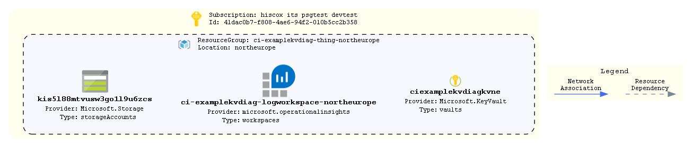

# keyvault-diagnostics

A terraform config to show how to create external resources for keyvault diagnostics requirement

## Pipelines

There are two supported approaches for deploying infrastructure resources through terraform. The first is known as `PSDeployTools` and is simply a powershell module for wrapping around the terraform binary. It allows you to call terraform under different modes (apply/destroy etc.) and makes use of REST calls for storing state files in Artifactory with optional encryption.

The second uses a Go library called Terratest, developed by Gruntwork. You write a Go test file and invoke `go test` at its location. This allows you to excute terraform under different modes allowing for persisted infrastructure while making use of deffered calls to properly CI infrastructure (build it, test it, destroy it). This template has an example Go test file under `environments/`. It does expect certain environment variables to be avaialble (for auth and state storage) but it will tell you when one is missing. It can be used as a template for deploying real infrastructure as you can target different deployments through a `VARFILE` environment variable - meaning that the structure of your test and what gets tested is the same across all environments. You can also manage the lifecycle of infrastructure as the terraform apply and destroy operations are managed through further environment variables, so you can pipleine different stages.

## How To Update this README.md

* terraform-docs has been used to automatically generate this readme based on comments, variables.tf and output.tf.
* Follow the setup instructions here: https://github.com/segmentio/terraform-docs
* Write your terraform-docs to a file like so: `terraform-docs md . | Out-File README.md`

## Diagrams



Unfortunately a number of tools that can parse Terraform code/statefiles and generate architetcure diagrams are limited and most are in their infancy. The built in `terraform graph` is only really useful for looking at dependencies and is too verbose to be considered a diagram on an environment.

We can however turn this on its head and look at using deployed resources to produce a diagram as a stop gap. AzViz is a tool which takes one or more resource groups as input and it will parse their contents and produce a more architecture-like diagram. It will also work out the relation between different resources. Check out all its features [here](https://github.com/PrateekKumarSingh/AzViz). To use it to store a diagram post deployment:

```pwsh
Connect-AzAccount
Set-AzContext -Subscription 'xxxx-xxxx'
Export-AzViz -ResourceGroup my-resource-group-1, my-rg-2 -Theme light -OutputFormat png -OutputFilePath 'diagrams/design.png' -CategoryDepth 1 -LabelVerbosity 2
```

## Requirements

| Name | Version |
|------|---------|
| <a name="requirement_terraform"></a> [terraform](#requirement\_terraform) | >= 1.0 |
| <a name="requirement_azurerm"></a> [azurerm](#requirement\_azurerm) | ~> 2 |

## Providers

| Name | Version |
|------|---------|
| <a name="provider_azurerm"></a> [azurerm](#provider\_azurerm) | ~> 2 |

## Modules

| Name | Source | Version |
|------|--------|---------|
| <a name="module_diagnostics_kv"></a> [diagnostics\_kv](#module\_diagnostics\_kv) | ../../azure-monitor-logging | n/a |
| <a name="module_keyvault"></a> [keyvault](#module\_keyvault) | ../../azure-keyvault | n/a |
| <a name="module_law"></a> [law](#module\_law) | ../../azure-log-analytics | n/a |

## Resources

| Name | Type |
|------|------|
| [azurerm_resource_group.rg](https://registry.terraform.io/providers/hashicorp/azurerm/latest/docs/resources/resource_group) | resource |

## Inputs

| Name | Description | Type | Default | Required |
|------|-------------|------|---------|:--------:|
| <a name="input_access_policies"></a> [access\_policies](#input\_access\_policies) | List of map of list of string defining access policies for the Key Vault. <br>See [terraform docs](https://www.terraform.io/docs/providers/azurerm/r/key_vault.html#certificate_permissions) for more info.<br>Each map item in the list can define a combination of *user\_principal\_names*, *group\_names* or *object\_ids* with a combination of **secret\_permissions**, **key\_permissions**, **certificate\_permissions** or **storage\_permissions**. <br>All fields are not required to be defined in each map. Eg<br>\<pre>[<br>  {<br>    user_principal_names = ["user1@domain","user2@domain"]<br>    certificate_permissions = ["create","delete","get","import"]<br>  },<br>  {<br>    group_names = ["group","another_group"]<br>    secret_permissions = ["get","list","set"]<br>    key_permissions = ["get","list"]<br>  },<br>  {<br>    object_ids = ["xxxxxxx-xxxxx-xxxx-xxxxxx","yyyyyy-yyyyy-yyyyy-yyyyyy"]<br>    group_names = ["some_group"]<br>    storage_permissions = ["backup","restore"]<br>  }<br>]<br>\</pre> | `list(map(any))` | `[]` | no |
| <a name="input_application"></a> [application](#input\_application) | Name of the application | `string` | n/a | yes |
| <a name="input_environment"></a> [environment](#input\_environment) | The environment name. Used as a tag and in naming the resource group | `string` | n/a | yes |
| <a name="input_location"></a> [location](#input\_location) | The region resources will be deployed to | `string` | `"northeurope"` | no |
| <a name="input_tags"></a> [tags](#input\_tags) | List of tags to be applied to resources | `map(string)` | `{}` | no |

## Outputs

| Name | Description |
|------|-------------|
| <a name="output_resource_group_name"></a> [resource\_group\_name](#output\_resource\_group\_name) | Name of the resource group where resources have been deployed to |
