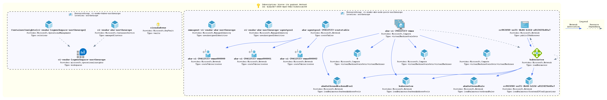

# kubes-cluster

This will create an Azure Kubernetes Service (AKS) cluster, subnet, log analytics worksapce, NSG and Key Vault.

## How To Update this README.md

* terraform-docs has been used to automatically generate this readme based on comments, variables.tf and output.tf.
* Follow the setup instructions here: [terraform-docs](https://github.com/segmentio/terraform-docs)
* Write your terraform-docs to a file like so: `terraform-docs md . | Out-File README.md`. Alternatively setup a pre-cmmit hook to always ensure your README.md is up to date

## Diagrams



Unfortunately a number of tools that can parse Terraform code/statefiles and generate architetcure diagrams are limited and most are in their infancy. The built in `terraform graph` is only really useful for looking at dependencies and is too verbose to be considered a diagram on an environment.

We can however turn this on its head and look at using deployed resources to produce a diagram as a stop gap. AzViz is a tool which takes one or more resource groups as input and it will parse their contents and produce a more architecture-like diagram. It will also work out the relation between different resources. Check out all its features [here](https://github.com/PrateekKumarSingh/AzViz). To use it to store a diagram post deployment:

```pwsh
Connect-AzAccount
Set-AzContext -Subscription 'xxxx-xxxx'
Export-AzViz -ResourceGroup my-resource-group-1, my-rg-2 -Theme light -OutputFormat png -OutputFilePath 'diagrams/design.png' -CategoryDepth 1 -LabelVerbosity 2
```

## Requirements

| Name | Version |
|------|---------|
| <a name="requirement_terraform"></a> [terraform](#requirement\_terraform) | >= 1.0 |
| <a name="requirement_azuread"></a> [azuread](#requirement\_azuread) | ~> 1.4 |
| <a name="requirement_azurerm"></a> [azurerm](#requirement\_azurerm) | ~> 2 |
| <a name="requirement_time"></a> [time](#requirement\_time) | ~>0.7 |

## Providers

| Name | Version |
|------|---------|
| <a name="provider_azurerm"></a> [azurerm](#provider\_azurerm) | ~> 2 |

## Modules

| Name | Source | Version |
|------|--------|---------|
| <a name="module_aks"></a> [aks](#module\_aks) | ../../azure-kubernetes-cluster | n/a |
| <a name="module_keyvault"></a> [keyvault](#module\_keyvault) | ../../azure-keyvault | n/a |
| <a name="module_law"></a> [law](#module\_law) | ../../azure-log-analytics | n/a |
| <a name="module_nsg"></a> [nsg](#module\_nsg) | ../../azure-network-security-group | n/a |
| <a name="module_subnet"></a> [subnet](#module\_subnet) | ../../azure-subnet | n/a |

## Resources

| Name | Type |
|------|------|
| [azurerm_resource_group.rg](https://registry.terraform.io/providers/hashicorp/azurerm/latest/docs/resources/resource_group) | resource |
| [azurerm_role_assignment.cluster](https://registry.terraform.io/providers/hashicorp/azurerm/latest/docs/resources/role_assignment) | resource |
| [azurerm_role_definition.aks_role](https://registry.terraform.io/providers/hashicorp/azurerm/latest/docs/resources/role_definition) | resource |
| [azurerm_subscription.current](https://registry.terraform.io/providers/hashicorp/azurerm/latest/docs/data-sources/subscription) | data source |

## Inputs

| Name | Description | Type | Default | Required |
|------|-------------|------|---------|:--------:|
| <a name="input_address_prefixes"></a> [address\_prefixes](#input\_address\_prefixes) | Subnet range to be created | `list(string)` | n/a | yes |
| <a name="input_aks_in_rules"></a> [aks\_in\_rules](#input\_aks\_in\_rules) | A Map of inbound NSG rules | `map` | `{}` | no |
| <a name="input_aks_out_rules"></a> [aks\_out\_rules](#input\_aks\_out\_rules) | A Map of outound NSG rules | `map` | `{}` | no |
| <a name="input_application"></a> [application](#input\_application) | Name of the application | `string` | n/a | yes |
| <a name="input_environment"></a> [environment](#input\_environment) | The environment name. Used as a tag and in naming the resource group | `string` | n/a | yes |
| <a name="input_keyvault_ip_rules"></a> [keyvault\_ip\_rules](#input\_keyvault\_ip\_rules) | List of IPs allowed to access key vault | `list(string)` | n/a | yes |
| <a name="input_location"></a> [location](#input\_location) | The region resources will be deployed to | `string` | `"northeurope"` | no |
| <a name="input_service_endpoints"></a> [service\_endpoints](#input\_service\_endpoints) | List of subnet service endpoints to enable | `list(any)` | <pre>[<br>  "Microsoft.Storage",<br>  "Microsoft.Sql",<br>  "Microsoft.AzureActiveDirectory",<br>  "Microsoft.KeyVault",<br>  "Microsoft.AzureCosmosDB"<br>]</pre> | no |
| <a name="input_ssh_pub_key"></a> [ssh\_pub\_key](#input\_ssh\_pub\_key) | Key for VM access. Never to be used | `any` | n/a | yes |
| <a name="input_tags"></a> [tags](#input\_tags) | List of tags to be applied to resources | `map(string)` | `{}` | no |
| <a name="input_virtual_network_name"></a> [virtual\_network\_name](#input\_virtual\_network\_name) | name of the vnet | `any` | n/a | yes |
| <a name="input_vnet_resource_group_name"></a> [vnet\_resource\_group\_name](#input\_vnet\_resource\_group\_name) | Resource group name of the vnet | `any` | n/a | yes |

## Outputs

| Name | Description |
|------|-------------|
| <a name="output_cluster_name"></a> [cluster\_name](#output\_cluster\_name) | Name of the Azure Kubernetes Service |
| <a name="output_fqdn"></a> [fqdn](#output\_fqdn) | Service fqdn used for remote configuration |
| <a name="output_host"></a> [host](#output\_host) | Service host used for remote configuration |
| <a name="output_kube_config"></a> [kube\_config](#output\_kube\_config) | Config block from azurerm\_kubernetes\_cluster |
| <a name="output_node_rg_name"></a> [node\_rg\_name](#output\_node\_rg\_name) | Name of the node resource group |
| <a name="output_resource_group_name"></a> [resource\_group\_name](#output\_resource\_group\_name) | Name of the resource group where resources have been deployed to |
