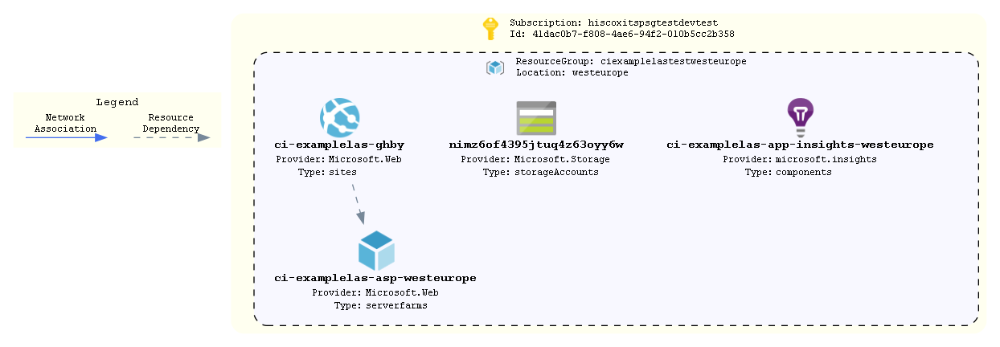

# logic-app-standard

An exmaple of deploying a Logic App Standard that uses Swift integration to restrict outbound traffic flow alongside Application Inisghts integration.

## How To Update this README.md

* terraform-docs has been used to automatically generate this readme based on comments, variables.tf and output.tf.
* Follow the setup instructions here: https://github.com/segmentio/terraform-docs
* Write your terraform-docs to a file like so: `terraform-docs md . | Out-File README.md`

## Diagrams



Unfortunately a number of tools that can parse Terraform code/statefiles and generate architetcure diagrams are limited and most are in their infancy. The built in `terraform graph` is only really useful for looking at dependencies and is too verbose to be considered a diagram on an environment.

We can however turn this on its head and look at using deployed resources to produce a diagram as a stop gap. AzViz is a tool which takes one or more resource groups as input and it will parse their contents and produce a more architecture-like diagram. It will also work out the relation between different resources. Check out all its features [here](https://github.com/PrateekKumarSingh/AzViz). To use it to store a diagram post deployment:

```pwsh
Connect-AzAccount
Set-AzContext -Subscription 'xxxx-xxxx'
Export-AzViz -ResourceGroup my-resource-group-1, my-rg-2 -Theme light -OutputFormat png -OutputFilePath 'diagrams/design.png' -CategoryDepth 1 -LabelVerbosity 2
```

## Requirements

| Name | Version |
|------|---------|
| <a name="requirement_terraform"></a> [terraform](#requirement\_terraform) | >= 1.0 |
| <a name="requirement_azurerm"></a> [azurerm](#requirement\_azurerm) | ~> 2 |
| <a name="requirement_time"></a> [time](#requirement\_time) | ~>0.7 |

## Providers

| Name | Version |
|------|---------|
| <a name="provider_azurerm"></a> [azurerm](#provider\_azurerm) | ~> 2 |
| <a name="provider_time"></a> [time](#provider\_time) | ~>0.7 |

## Modules

| Name | Source | Version |
|------|--------|---------|
| <a name="module_ai"></a> [ai](#module\_ai) | ../../azure-application-insights | n/a |
| <a name="module_asp"></a> [asp](#module\_asp) | ../../azure-app-service-plan | n/a |
| <a name="module_las"></a> [las](#module\_las) | ../../azure-logic-app-standard | n/a |
| <a name="module_nsg_outbound"></a> [nsg\_outbound](#module\_nsg\_outbound) | ../../azure-network-security-group | n/a |
| <a name="module_storage"></a> [storage](#module\_storage) | ../../azure-storage-account | n/a |
| <a name="module_subnet_outbound"></a> [subnet\_outbound](#module\_subnet\_outbound) | ../../azure-subnet | n/a |

## Resources

| Name | Type |
|------|------|
| [azurerm_app_service_virtual_network_swift_connection.vnet_out](https://registry.terraform.io/providers/hashicorp/azurerm/latest/docs/resources/app_service_virtual_network_swift_connection) | resource |
| [azurerm_resource_group.resource_group](https://registry.terraform.io/providers/hashicorp/azurerm/latest/docs/resources/resource_group) | resource |
| [time_static.t](https://registry.terraform.io/providers/hashicorp/time/latest/docs/resources/static) | resource |
| [azurerm_log_analytics_workspace.law](https://registry.terraform.io/providers/hashicorp/azurerm/latest/docs/data-sources/log_analytics_workspace) | data source |

## Inputs

| Name | Description | Type | Default | Required |
|------|-------------|------|---------|:--------:|
| <a name="input_address_prefixes_outbound"></a> [address\_prefixes\_outbound](#input\_address\_prefixes\_outbound) | The address range of subnet for outbound logic app connectivity | `list(string)` | n/a | yes |
| <a name="input_application"></a> [application](#input\_application) | Name of the application | `string` | n/a | yes |
| <a name="input_environment"></a> [environment](#input\_environment) | The environment name. Used as a tag and in naming the resource group | `string` | n/a | yes |
| <a name="input_law_name"></a> [law\_name](#input\_law\_name) | The name of your log analytics workspace | `string` | n/a | yes |
| <a name="input_law_resource_group_name"></a> [law\_resource\_group\_name](#input\_law\_resource\_group\_name) | The name of the resource group containing your log analytics workspace | `string` | n/a | yes |
| <a name="input_location"></a> [location](#input\_location) | The region resources will be deployed to | `string` | `"northeurope"` | no |
| <a name="input_nsg_in_rules"></a> [nsg\_in\_rules](#input\_nsg\_in\_rules) | A Map of inbound NSG rules | `map` | `{}` | no |
| <a name="input_nsg_out_rules"></a> [nsg\_out\_rules](#input\_nsg\_out\_rules) | A Map of outound NSG rules | `map` | `{}` | no |
| <a name="input_tags"></a> [tags](#input\_tags) | List of tags to be applied to resources | `map(string)` | `{}` | no |
| <a name="input_virtual_network_name"></a> [virtual\_network\_name](#input\_virtual\_network\_name) | The name of your virtual network where you'd like your new subnet and PE | `string` | n/a | yes |
| <a name="input_vnet_resource_group_name"></a> [vnet\_resource\_group\_name](#input\_vnet\_resource\_group\_name) | The name of the resource group which contains your target vnet for building a subnetand PE | `string` | n/a | yes |

## Outputs

| Name | Description |
|------|-------------|
| <a name="output_resource_group_name"></a> [resource\_group\_name](#output\_resource\_group\_name) | Name of the resource group where resources have been deployed to |
