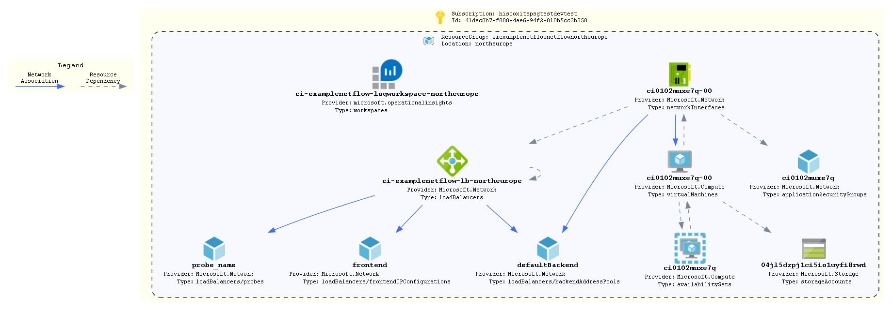

# network-flow-nsg

An example of applying the network flow nsg logs to a sample vm/subnet to capture traffic.

Note: This example includes a separate rule base that lists all the BUs current VNET ranges.

This will need to be updated with any new VNETS added by any BUs, but does incldue a Hiscox catch-all group

## How To Update this README.md

* terraform-docs has been used to automatically generate this readme based on comments, variables.tf and output.tf.
* Follow the setup instructions here: https://github.com/segmentio/terraform-docs
* Write your terraform-docs to a file like so: `terraform-docs md . | Out-File README.md`

## Diagrams

## Requirements

| Name | Version |
|------|---------|
|  [terraform](#requirement\_terraform) | >= 1.0 |
|  [azurerm](#requirement\_azurerm) | ~> 2 |
|  [time](#requirement\_time) | ~>0.7 |

## Providers

| Name | Version |
|------|---------|
|  [azurerm](#provider\_azurerm) | ~> 2 |
|  [time](#provider\_time) | ~>0.7 |

## Modules

| Name | Source | Version |
|------|--------|---------|
|  [flow\_log](#module\_flow\_log) | ../../azure-network-watcher-flow-log | n/a |
|  [law](#module\_law) | ../../azure-log-analytics | n/a |
|  [lb-int](#module\_lb-int) | ../../azure-load-balancer | n/a |
|  [nsg](#module\_nsg) | ../../azure-network-security-group | n/a |
|  [storage](#module\_storage) | ../../azure-storage-account | n/a |
|  [subnet](#module\_subnet) | ../../azure-subnet | n/a |
|  [vm](#module\_vm) | ../../azure-vm | n/a |

## Resources

| Name | Type |
|------|------|
| [azurerm_network_security_rule.nsg_in](https://registry.terraform.io/providers/hashicorp/azurerm/latest/docs/resources/network_security_rule) | resource |
| [azurerm_network_security_rule.nsg_rule_permit_lb_vms_ssh](https://registry.terraform.io/providers/hashicorp/azurerm/latest/docs/resources/network_security_rule) | resource |
| [azurerm_resource_group.resource_group](https://registry.terraform.io/providers/hashicorp/azurerm/latest/docs/resources/resource_group) | resource |
| [time_static.t](https://registry.terraform.io/providers/hashicorp/time/latest/docs/resources/static) | resource |
| [azurerm_key_vault.kv](https://registry.terraform.io/providers/hashicorp/azurerm/latest/docs/data-sources/key_vault) | data source |
| [azurerm_key_vault_secret.admin_password](https://registry.terraform.io/providers/hashicorp/azurerm/latest/docs/data-sources/key_vault_secret) | data source |
| [azurerm_network_watcher.network_watcher](https://registry.terraform.io/providers/hashicorp/azurerm/latest/docs/data-sources/network_watcher) | data source |

## Inputs

| Name | Description | Type | Default | Required |
|------|-------------|------|---------|:--------:|
|  [address\_prefixes](#input\_address\_prefixes) | IP address range for subnet | `string` | n/a | yes |
|  [analytics](#input\_analytics) | Check whether the log analytics element of the flow logs is deployed | `bool` | `true` | no |
|  [application](#input\_application) | Name of the application | `string` | n/a | yes |
|  [business](#input\_business) | Business unit which owns the infrastructure | `string` | n/a | yes |
|  [disk\_os\_size\_linux](#input\_disk\_os\_size\_linux) | Size of linux os disk in GB | `string` | `"64"` | no |
|  [environment](#input\_environment) | The environment name. Used as a tag and in naming the resource group | `string` | n/a | yes |
|  [key\_vault\_name](#input\_key\_vault\_name) | Name of the key vault, used to retrieve VM admin password | `string` | n/a | yes |
|  [key\_vault\_rg](#input\_key\_vault\_rg) | Resource group that contains key vault | `string` | n/a | yes |
|  [location](#input\_location) | The region resources will be deployed to | `string` | `"northeurope"` | no |
|  [network\_watcher\_name](#input\_network\_watcher\_name) | Name of network watcher | `string` | n/a | yes |
|  [network\_watcher\_resource\_group\_name](#input\_network\_watcher\_resource\_group\_name) | Resource Group for network watcher | `string` | n/a | yes |
|  [nsg\_in\_rules](#input\_nsg\_in\_rules) | A Map of inbound NSG rules | `map` | `{}` | no |
|  [nsg\_out\_rules](#input\_nsg\_out\_rules) | A Map of outound NSG rules | `map` | `{}` | no |
|  [reporting\_interval](#input\_reporting\_interval) | Frequency of updates to logs. Acceptable values are 60 or 10 (minutes) | `string` | `"60"` | no |
|  [server\_environment](#input\_server\_environment) | Used to generate the name of servers based on the server-identification standard | `string` | n/a | yes |
|  [service](#input\_service) | Type of  infrastructure | `string` | n/a | yes |
|  [source\_image\_reference](#input\_source\_image\_reference) | n/a | `map(string)` | <pre>{   "offer": "RHEL",   "publisher": "RedHat",   "sku": "7-LVM",   "version": "latest" }</pre> | no |
|  [subnet\_name](#input\_subnet\_name) | New Subnet Name | `string` | n/a | yes |
|  [tags](#input\_tags) | List of tags to be applied to resources | `map(string)` | `{}` | no |
|  [virtual\_network\_name](#input\_virtual\_network\_name) | Vnet name for new subnet | `string` | n/a | yes |
|  [virtual\_network\_resource\_group\_name](#input\_virtual\_network\_resource\_group\_name) | Resource Group for Vnet | `string` | n/a | yes |
|  [vm\_size](#input\_vm\_size) | The size of VM ot provision | `string` | n/a | yes |

## Outputs

| Name | Description |
|------|-------------|
|  [resource\_group\_name](#output\_resource\_group\_name) | Name of the resource group where resources have been deployed to |
