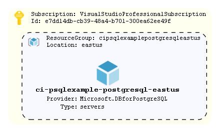

# Azure Database for PostgreSQL - Single Server.

An example provisioning an Azure Database for PostgreSQL - Single Server.

The example relies heavily upon the defaults in the module:

* Performance configuration : General Purpose, 2 vCore(s), 5 GB.
* PostgreSQL version        : 11
* SSL enforce status        : ENABLED
* Minimum TLS               : 1.2
* Backup retention          : 7 days
* Storage Auto-growth       : Yes

Database(s) defaults:
* charset                   : UTF8
* collation                 : English\_United States.1252

Example uses the module auto-generated default local PostgreSQL admin account and password (not stored anywhere other than in tfstate).
> Azure Active Directory admins are recommended for real world use.

The example PostgreSQL server is built with 'public\_network\_access\_enabled = false' (module default).
> A Private Endpoint would be required in order to connect.

## How To Update this README.md

terraform-docs has been used to automatically generate this readme based on comments, variables.tf and output.tf.
Follow the setup instructions here: https://github.com/segmentio/terraform-docs
Write your terraform-docs to a file like so: `terraform-docs md . | Out-File README.md`

## Diagrams



AzViz has been used to automatically generate this.

```pwsh
Connect-AzAccount
Set-AzContext -Subscription 'xxxx-xxxx'
Export-AzViz -ResourceGroup my-resource-group-1, my-rg-2 -Theme light -OutputFormat png -OutputFilePath 'diagrams/design.png' -CategoryDepth 1 -LabelVerbosity 2
```

## Requirements

| Name | Version |
|------|---------|
| <a name="requirement_terraform"></a> [terraform](#requirement\_terraform) | >= 1.0 |
| <a name="requirement_azurerm"></a> [azurerm](#requirement\_azurerm) | ~> 2 |
| <a name="requirement_time"></a> [time](#requirement\_time) | ~>0.7 |

## Providers

| Name | Version |
|------|---------|
| <a name="provider_time"></a> [time](#provider\_time) | 0.7.2 |

## Modules

| Name | Source | Version |
|------|--------|---------|
| <a name="module_postgresql"></a> [postgresql](#module\_postgresql) | ../../azure-postgresql | n/a |

## Resources

| Name | Type |
|------|------|
| [time_static.t](https://registry.terraform.io/providers/hashicorp/time/latest/docs/resources/static) | resource |

## Inputs

| Name | Description | Type | Default | Required |
|------|-------------|------|---------|:--------:|
| <a name="input_application"></a> [application](#input\_application) | Name of the application | `string` | n/a | yes |
| <a name="input_environment"></a> [environment](#input\_environment) | The environment name. Used as a tag and in naming the resource group | `string` | n/a | yes |
| <a name="input_location"></a> [location](#input\_location) | The region resources will be deployed to | `string` | `"northeurope"` | no |
| <a name="input_postgresql_database"></a> [postgresql\_database](#input\_postgresql\_database) | "List of PostgreSQL databases, each map must contain a name field. Optional parameters that can be overriden (defaults can be found under locals.tf):<br>{<br>  charset<br>  collation<br>}" | `list(map(string))` | n/a | yes |
| <a name="input_tags"></a> [tags](#input\_tags) | List of tags to be applied to resources | `map(string)` | `{}` | no |

## Outputs

| Name | Description |
|------|-------------|
| <a name="output_postgresql_server_fqdn"></a> [postgresql\_server\_fqdn](#output\_postgresql\_server\_fqdn) | FQDN of the PostgreSQL Server |
| <a name="output_postgresql_server_name"></a> [postgresql\_server\_name](#output\_postgresql\_server\_name) | Name of the PostgreSQL Server |
| <a name="output_resource_group_name"></a> [resource\_group\_name](#output\_resource\_group\_name) | Name of the resource group where resources have been deployed to |
