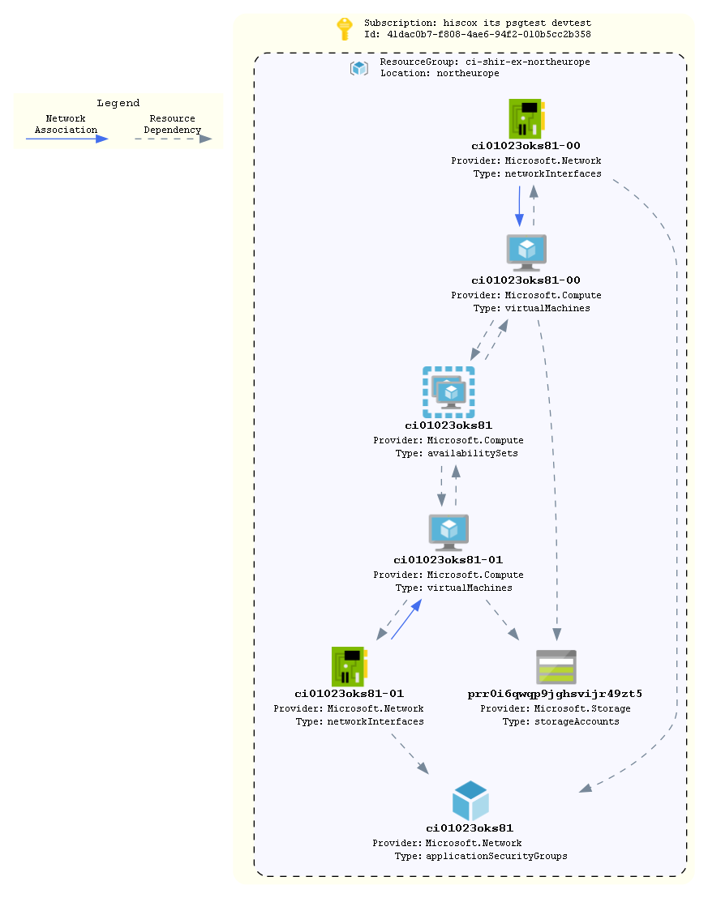

# self-hosted-integration-runtime

An example consumer config for deploying Azure Data Factories with shared & linked self-hosted integration runtimes.

## How To Update this README.md

* terraform-docs has been used to automatically generate this readme based on comments, variables.tf and output.tf.
* Follow the setup instructions here: https://github.com/segmentio/terraform-docs
* Write your terraform-docs to a file like so: `terraform-docs md . | Out-File README.md`

## Diagrams



Unfortunately a number of tools that can parse Terraform code/statefiles and generate architetcure diagrams are limited and most are in their infancy. The built in `terraform graph` is only really useful for looking at dependencies and is too verbose to be considered a diagram on an environment.

We can however turn this on its head and look at using deployed resources to produce a diagram as a stop gap. AzViz is a tool which takes one or more resource groups as input and it will parse their contents and produce a more architecture-like diagram. It will also work out the relation between different resources. Check out all its features [here](https://github.com/PrateekKumarSingh/AzViz). To use it to store a diagram post deployment:

```pwsh
Connect-AzAccount
Set-AzContext -Subscription 'xxxx-xxxx'
Export-AzViz -ResourceGroup my-resource-group-1, my-rg-2 -Theme light -OutputFormat png -OutputFilePath 'diagrams/design.png' -CategoryDepth 1 -LabelVerbosity 2
```

## Requirements

| Name | Version |
|------|---------|
| <a name="requirement_terraform"></a> [terraform](#requirement\_terraform) | >= 1.0 |
| <a name="requirement_azurerm"></a> [azurerm](#requirement\_azurerm) | ~> 2 |
| <a name="requirement_time"></a> [time](#requirement\_time) | ~>0.7 |

## Providers

| Name | Version |
|------|---------|
| <a name="provider_azurerm"></a> [azurerm](#provider\_azurerm) | ~> 2 |
| <a name="provider_time"></a> [time](#provider\_time) | ~>0.7 |

## Modules

| Name | Source | Version |
|------|--------|---------|
| <a name="module_df1"></a> [df1](#module\_df1) | ../../azure-data-factory | n/a |
| <a name="module_df2"></a> [df2](#module\_df2) | ../../azure-data-factory | n/a |
| <a name="module_linked_shir"></a> [linked\_shir](#module\_linked\_shir) | ../../azure-self-hosted-integration-runtime | n/a |
| <a name="module_shir"></a> [shir](#module\_shir) | ../../azure-self-hosted-integration-runtime | n/a |
| <a name="module_shir_vm"></a> [shir\_vm](#module\_shir\_vm) | ../../azure-vm | n/a |

## Resources

| Name | Type |
|------|------|
| [azurerm_resource_group.rg](https://registry.terraform.io/providers/hashicorp/azurerm/latest/docs/resources/resource_group) | resource |
| [time_sleep.wait_600_seconds](https://registry.terraform.io/providers/hashicorp/time/latest/docs/resources/sleep) | resource |
| [azurerm_key_vault.kv](https://registry.terraform.io/providers/hashicorp/azurerm/latest/docs/data-sources/key_vault) | data source |
| [azurerm_subnet.subnet](https://registry.terraform.io/providers/hashicorp/azurerm/latest/docs/data-sources/subnet) | data source |

## Inputs

| Name | Description | Type | Default | Required |
|------|-------------|------|---------|:--------:|
| <a name="input_admin_password"></a> [admin\_password](#input\_admin\_password) | n/a | `any` | n/a | yes |
| <a name="input_application"></a> [application](#input\_application) | Name of the application | `string` | n/a | yes |
| <a name="input_business"></a> [business](#input\_business) | n/a | `any` | n/a | yes |
| <a name="input_environment"></a> [environment](#input\_environment) | The environment name. Used as a tag and in naming the resource group | `string` | n/a | yes |
| <a name="input_location"></a> [location](#input\_location) | The region resources will be deployed to | `string` | `"northeurope"` | no |
| <a name="input_server_environment"></a> [server\_environment](#input\_server\_environment) | Used to generate the name of servers based on the server-identification standard | `string` | n/a | yes |
| <a name="input_service"></a> [service](#input\_service) | n/a | `any` | n/a | yes |
| <a name="input_shir_certificate_domain"></a> [shir\_certificate\_domain](#input\_shir\_certificate\_domain) | n/a | `any` | n/a | yes |
| <a name="input_shir_certificate_name"></a> [shir\_certificate\_name](#input\_shir\_certificate\_name) | n/a | `any` | n/a | yes |
| <a name="input_shir_key_vault_name"></a> [shir\_key\_vault\_name](#input\_shir\_key\_vault\_name) | n/a | `any` | n/a | yes |
| <a name="input_shir_key_vault_resource_group_name"></a> [shir\_key\_vault\_resource\_group\_name](#input\_shir\_key\_vault\_resource\_group\_name) | n/a | `any` | n/a | yes |
| <a name="input_shir_secret_name"></a> [shir\_secret\_name](#input\_shir\_secret\_name) | n/a | `any` | n/a | yes |
| <a name="input_subnet_name"></a> [subnet\_name](#input\_subnet\_name) | n/a | `any` | n/a | yes |
| <a name="input_tags"></a> [tags](#input\_tags) | List of tags to be applied to resources | `map(string)` | `{}` | no |
| <a name="input_virtual_network_name"></a> [virtual\_network\_name](#input\_virtual\_network\_name) | n/a | `any` | n/a | yes |
| <a name="input_virtual_network_resource_group_name"></a> [virtual\_network\_resource\_group\_name](#input\_virtual\_network\_resource\_group\_name) | n/a | `any` | n/a | yes |
| <a name="input_vm_count_windows"></a> [vm\_count\_windows](#input\_vm\_count\_windows) | n/a | `any` | n/a | yes |
| <a name="input_vm_size"></a> [vm\_size](#input\_vm\_size) | n/a | `any` | n/a | yes |

## Outputs

| Name | Description |
|------|-------------|
| <a name="output_resource_group_name"></a> [resource\_group\_name](#output\_resource\_group\_name) | Name of the resource group where resources have been deployed to |
