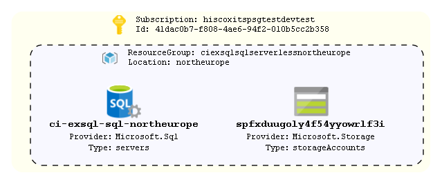

# sql-serverless-with-users

Example provisioning a PaaS SQL instance with 2 serverless databases. Example also demonstrates creating contained users via Terraform

## How To Update this README.md

terraform-docs has been used to automatically generate this readme based on comments, variables.tf and output.tf.
Follow the setup instructions here: https://github.com/segmentio/terraform-docs
Write your terraform-docs to a file like so: `terraform-docs md . | Out-File README.md`

## Diagrams



Unfortunately a number of tools that can parse Terraform code/statefiles and generate architetcure diagrams are limited and most are in their infancy. The built in `terraform graph` is only really useful for looking at dependencies and is too verbose to be considered a diagram on an environment.

We can however turn this on its head and look at using deployed resources to produce a diagram as a stop gap. AzViz is a tool which takes one or more resource groups as input and it will parse their contents and produce a more architecture-like diagram. It will also work out the relation between different resources. Check out all its features [here](https://github.com/PrateekKumarSingh/AzViz). To use it to store a diagram post deployment:

```pwsh
Connect-AzAccount
Set-AzContext -Subscription 'xxxx-xxxx'
Export-AzViz -ResourceGroup my-resource-group-1, my-rg-2 -Theme light -OutputFormat png -OutputFilePath 'diagrams/design.png' -CategoryDepth 1 -LabelVerbosity 2
```

## Requirements

| Name | Version |
|------|---------|
| <a name="requirement_terraform"></a> [terraform](#requirement\_terraform) | >= 1.0 |
| <a name="requirement_azurerm"></a> [azurerm](#requirement\_azurerm) | ~> 2 |

## Providers

| Name | Version |
|------|---------|
| <a name="provider_azurerm"></a> [azurerm](#provider\_azurerm) | 2.99.0 |

## Modules

| Name | Source | Version |
|------|--------|---------|
| <a name="module_sql_serverless"></a> [sql\_serverless](#module\_sql\_serverless) | ../../azure-sql | n/a |

## Resources

| Name | Type |
|------|------|
| [azurerm_resource_group.rg](https://registry.terraform.io/providers/hashicorp/azurerm/latest/docs/resources/resource_group) | resource |

## Inputs

| Name | Description | Type | Default | Required |
|------|-------------|------|---------|:--------:|
| <a name="input_allow_subnet_ids"></a> [allow\_subnet\_ids](#input\_allow\_subnet\_ids) | A map of subnet IDs allow access to the DBs. e.g: { bamboo='...', platform='...' } | `map(string)` | `{}` | no |
| <a name="input_application"></a> [application](#input\_application) | Name of the application | `string` | n/a | yes |
| <a name="input_database_users"></a> [database\_users](#input\_database\_users) | List of map of strings detailng contained users to be created in Azure SQL DBs. The map structure is dependant on the user type (see module) | `list(map(any))` | `[]` | no |
| <a name="input_environment"></a> [environment](#input\_environment) | The environment name. Used as a tag and in naming the resource group | `string` | n/a | yes |
| <a name="input_location"></a> [location](#input\_location) | The region resources will be deployed to | `string` | `"northeurope"` | no |
| <a name="input_standalone_dbs"></a> [standalone\_dbs](#input\_standalone\_dbs) | Map of maps containing config for standalone databases e.g: { db1={ max\_size = 32, edition='Premium', performance\_level='P1'}, db2={...} ] | `map(map(string))` | `{}` | no |
| <a name="input_tags"></a> [tags](#input\_tags) | List of tags to be applied to resources | `map(string)` | `{}` | no |

## Outputs

| Name | Description |
|------|-------------|
| <a name="output_resource_group_name"></a> [resource\_group\_name](#output\_resource\_group\_name) | Name of the resource group where resources have been deployed to |
