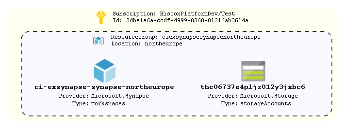

# Synapse Workspace

This code is a demonstration of a Synapse Workspace deployment. The example includes the creation of a SQL pool and additional data lake gen2 filesystems (using storage account module). A pre-requisite data lake gen2 filesystem,
which is used as the "primary" storage account for a Synapse workspace, is also created within the Synapse module. The example also creates a Azure Active Directory Admin user.

The Synapse module sets 'public\_network\_access\_enabled' to false by default, requiring a private endpoint to manage connectivity, which is our recommended design. This example however explicitly sets public access
to "true" as private endpoints are out of scope of the example. In this scenario the module will create a series of default firewall rules, but consumer code should create further rules dependant on requirements.

## How To Update this README.md

* terraform-docs has been used to automatically generate this readme based on comments, variables.tf and output.tf.
* Follow the setup instructions here: https://github.com/segmentio/terraform-docs
* Write your terraform-docs to a file like so: `terraform-docs md . | Out-File README.md`

## Diagrams



Unfortunately a number of tools that can parse Terraform code/statefiles and generate architetcure diagrams are limited and most are in their infancy. The built in `terraform graph` is only really useful for looking at dependencies and is too verbose to be considered a diagram on an environment.

We can however turn this on its head and look at using deployed resources to produce a diagram as a stop gap. AzViz is a tool which takes one or more resource groups as input and it will parse their contents and produce a more architecture-like diagram. It will also work out the relation between different resources. Check out all its features [here](https://github.com/PrateekKumarSingh/AzViz). To use it to store a diagram post deployment:

```pwsh
Connect-AzAccount
Set-AzContext -Subscription 'xxxx-xxxx'
Export-AzViz -ResourceGroup my-resource-group-1, my-rg-2 -Theme light -OutputFormat png -OutputFilePath 'diagrams/design.png' -CategoryDepth 1 -LabelVerbosity 2
```

## Requirements

| Name | Version |
|------|---------|
| <a name="requirement_terraform"></a> [terraform](#requirement\_terraform) | >= 1.0 |
| <a name="requirement_azurerm"></a> [azurerm](#requirement\_azurerm) | ~> 2 |
| <a name="requirement_time"></a> [time](#requirement\_time) | ~>0.7 |

## Providers

| Name | Version |
|------|---------|
| <a name="provider_azurerm"></a> [azurerm](#provider\_azurerm) | 2.99.0 |
| <a name="provider_time"></a> [time](#provider\_time) | 0.7.2 |

## Modules

| Name | Source | Version |
|------|--------|---------|
| <a name="module_azure-synapse"></a> [azure-synapse](#module\_azure-synapse) | ../../azure-synapse | n/a |
| <a name="module_storage"></a> [storage](#module\_storage) | ../../azure-storage-account | n/a |

## Resources

| Name | Type |
|------|------|
| [azurerm_resource_group.rg](https://registry.terraform.io/providers/hashicorp/azurerm/latest/docs/resources/resource_group) | resource |
| [time_static.t](https://registry.terraform.io/providers/hashicorp/time/latest/docs/resources/static) | resource |

## Inputs

| Name | Description | Type | Default | Required |
|------|-------------|------|---------|:--------:|
| <a name="input_aad_admin_user"></a> [aad\_admin\_user](#input\_aad\_admin\_user) | The Azure AD Admin user for the Synapse Workspace | `any` | n/a | yes |
| <a name="input_application"></a> [application](#input\_application) | Name of the application | `string` | n/a | yes |
| <a name="input_dlg2fs"></a> [dlg2fs](#input\_dlg2fs) | List of names of additional data lake gen2 filesystem to be created in storage account | `list(string)` | n/a | yes |
| <a name="input_environment"></a> [environment](#input\_environment) | The environment name. Used as a tag and in naming the resource group | `string` | n/a | yes |
| <a name="input_location"></a> [location](#input\_location) | The region resources will be deployed to | `string` | `"northeurope"` | no |
| <a name="input_sqlpools"></a> [sqlpools](#input\_sqlpools) | map of Synapse SQL Pools | `list(map(string))` | n/a | yes |
| <a name="input_synapse_dlg2fs_name"></a> [synapse\_dlg2fs\_name](#input\_synapse\_dlg2fs\_name) | Name of the Synapse Workspace primary data lake gen2 filesystem (This is a pre-requestite of a Synapase Workspace and will be created by the module if not suplied) | `any` | n/a | yes |
| <a name="input_tags"></a> [tags](#input\_tags) | List of tags to be applied to resources | `map(string)` | `{}` | no |

## Outputs

| Name | Description |
|------|-------------|
| <a name="output_resource_group_name"></a> [resource\_group\_name](#output\_resource\_group\_name) | Name of the resource group where resources have been deployed to |
