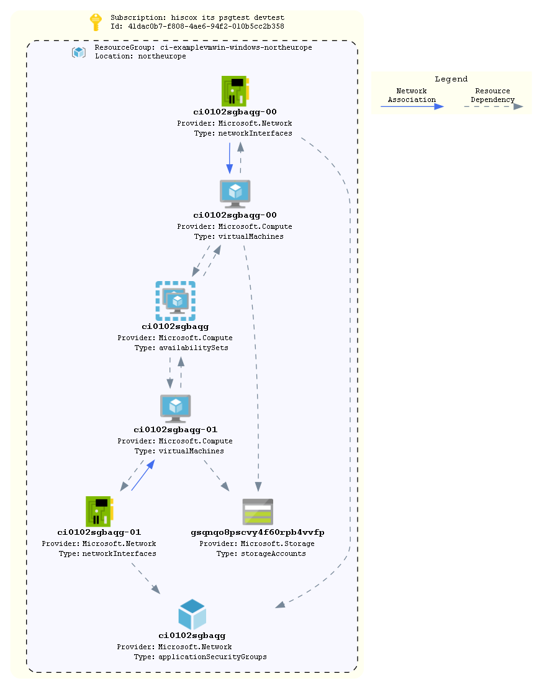

# vm-windows

An example deployment of a Windows based VM

## How To Update this README.md

terraform-docs has been used to automatically generate this readme based on comments, variables.tf and output.tf.
Follow the setup instructions here: https://github.com/segmentio/terraform-docs
Write your terraform-docs to a file like so: `terraform-docs md . | Out-File README.md`

## Diagrams



Unfortunately a number of tools that can parse Terraform code/statefiles and generate architetcure diagrams are limited and most are in their infancy. The built in `terraform graph` is only really useful for looking at dependencies and is too verbose to be considered a diagram on an environment.

We can however turn this on its head and look at using deployed resources to produce a diagram as a stop gap. AzViz is a tool which takes one or more resource groups as input and it will parse their contents and produce a more architecture-like diagram. It will also work out the relation between different resources. Check out all its features [here](https://github.com/PrateekKumarSingh/AzViz). To use it to store a diagram post deployment:

```pwsh
Connect-AzAccount
Set-AzContext -Subscription 'xxxx-xxxx'
Export-AzViz -ResourceGroup my-resource-group-1, my-rg-2 -Theme light -OutputFormat png -OutputFilePath 'diagrams/design.png' -CategoryDepth 1 -LabelVerbosity 2
```

## Requirements

| Name | Version |
|------|---------|
| <a name="requirement_terraform"></a> [terraform](#requirement\_terraform) | >= 1.0 |
| <a name="requirement_azurerm"></a> [azurerm](#requirement\_azurerm) | ~> 2 |

## Providers

| Name | Version |
|------|---------|
| <a name="provider_azurerm"></a> [azurerm](#provider\_azurerm) | ~> 2 |

## Modules

| Name | Source | Version |
|------|--------|---------|
| <a name="module_law"></a> [law](#module\_law) | ../../azure-log-analytics | n/a |
| <a name="module_vm"></a> [vm](#module\_vm) | ../../azure-vm | n/a |

## Resources

| Name | Type |
|------|------|
| [azurerm_resource_group.rg](https://registry.terraform.io/providers/hashicorp/azurerm/latest/docs/resources/resource_group) | resource |
| [azurerm_key_vault.kv](https://registry.terraform.io/providers/hashicorp/azurerm/latest/docs/data-sources/key_vault) | data source |
| [azurerm_key_vault_secret.admin_password](https://registry.terraform.io/providers/hashicorp/azurerm/latest/docs/data-sources/key_vault_secret) | data source |
| [azurerm_subnet.subnet](https://registry.terraform.io/providers/hashicorp/azurerm/latest/docs/data-sources/subnet) | data source |

## Inputs

| Name | Description | Type | Default | Required |
|------|-------------|------|---------|:--------:|
| <a name="input_application"></a> [application](#input\_application) | Name of the application | `string` | n/a | yes |
| <a name="input_business"></a> [business](#input\_business) | Business unit which owns the infrastructure | `string` | n/a | yes |
| <a name="input_environment"></a> [environment](#input\_environment) | The environment name. Used as a tag and in naming the resource group | `string` | n/a | yes |
| <a name="input_key_vault_name"></a> [key\_vault\_name](#input\_key\_vault\_name) | Name of the key vault, used to retrieve VM admin password | `string` | n/a | yes |
| <a name="input_key_vault_rg"></a> [key\_vault\_rg](#input\_key\_vault\_rg) | Resource group that contains key vault | `string` | n/a | yes |
| <a name="input_location"></a> [location](#input\_location) | The region resources will be deployed to | `string` | `"northeurope"` | no |
| <a name="input_patching"></a> [patching](#input\_patching) | Allocates VM to Ivanti Patch Group | `string` | `"0"` | no |
| <a name="input_server_environment"></a> [server\_environment](#input\_server\_environment) | Used to generate the name of servers based on the server-identification standard | `string` | n/a | yes |
| <a name="input_service"></a> [service](#input\_service) | Type of  infrastructure | `string` | n/a | yes |
| <a name="input_source_image_reference"></a> [source\_image\_reference](#input\_source\_image\_reference) | n/a | `map(string)` | <pre>{<br>  "offer": "WindowsServer",<br>  "publisher": "MicrosoftWindowsServer",<br>  "sku": "2016-Datacenter",<br>  "version": "latest"<br>}</pre> | no |
| <a name="input_subnet_name"></a> [subnet\_name](#input\_subnet\_name) | The name of the subnet to create | `string` | n/a | yes |
| <a name="input_tags"></a> [tags](#input\_tags) | List of tags to be applied to resources | `map(string)` | `{}` | no |
| <a name="input_vm_size"></a> [vm\_size](#input\_vm\_size) | The size of VM ot provision | `string` | n/a | yes |
| <a name="input_vnet_name"></a> [vnet\_name](#input\_vnet\_name) | The name of the target virtual netowrk | `string` | n/a | yes |
| <a name="input_vnet_resource_group_name"></a> [vnet\_resource\_group\_name](#input\_vnet\_resource\_group\_name) | The resource group that contains to target virtual network | `string` | n/a | yes |

## Outputs

| Name | Description |
|------|-------------|
| <a name="output_resource_group_name"></a> [resource\_group\_name](#output\_resource\_group\_name) | Name of the resource group where resources have been deployed to |
